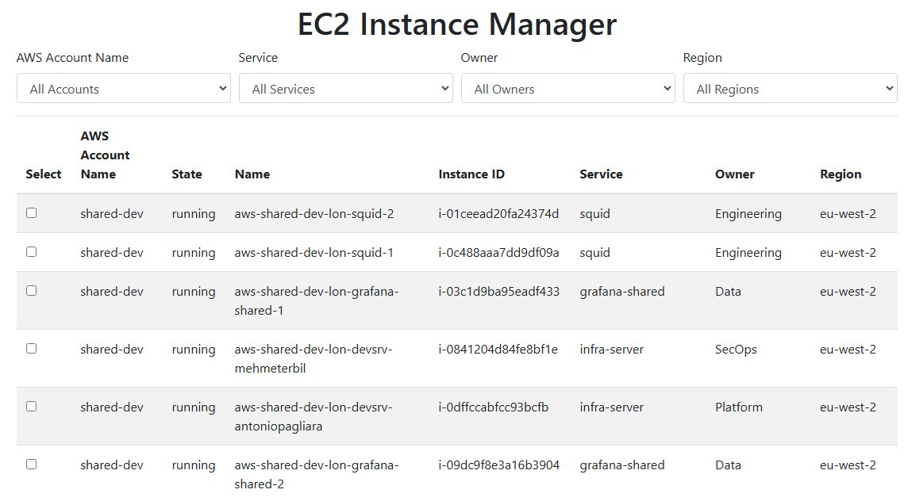

## Description

Web application for restarting EC2 instances from all accounts and regions.
This application does following:
* Authenticate user using Entra and authorize only users from specific User Group
* Connect to S3 bucket in  `shared-prod` account and retrieve inventory EC2 data from CSV file stored in that bucket. 
* Present Webpage with filtering options to select subset of EC2 instances for specific region, account and Owner.
* Restart selected EC2 instances.

## Docker

Build image

```
export TAG="1.0"
export IMAGE="ec2-restart-manager"
docker build -t ec2-restart-manager:${TAG} .
```

## Authentication
Provide Azure client secret as env var
```
export AZURE_AD_CLIENT_SECRET="XXXXXXXXXXXXXXXXXXXXXXXXXXXX"
```

# Start app
```
go run main.go
```

